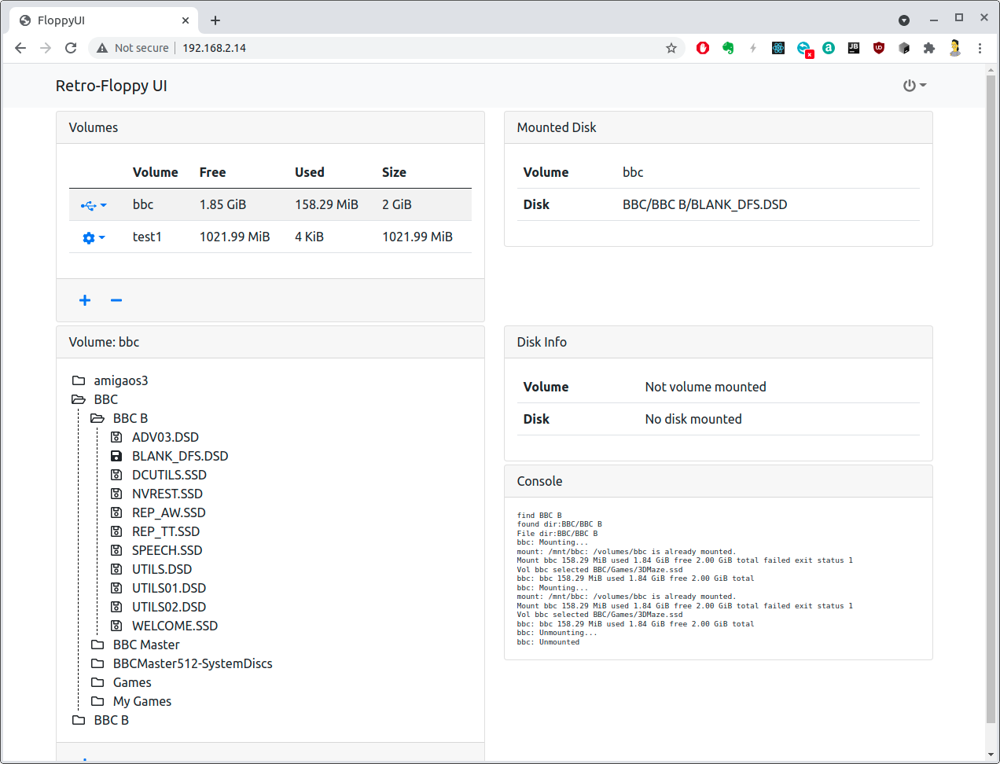
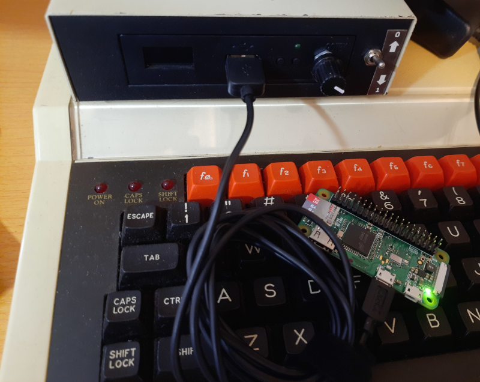

# Retro Floppy UI

Retro-Floppy UI is a web based application for managing & using a GoTek floppy emulator
running the [Flash Floppy](https://github.com/keirf/FlashFloppy) firmware.

Normally with a GoTek you connect a USB flash drive containing the disk images and use the front panel
to select which disk you want.

However, if you are into developing on these old machines, it becomes a hassle to keep changing the drive from your
main computer and the GoTek. After a while you can cause wear & tear on the ports & drive.

What Retro-Floppy UI does is permanently connect a virtual drive to the GoTek which you can then access over WiFi.
Uploading new images is then simple without the need to keep swapping the drive.

This is currently in an alpha state - the basic functionality is now working, but it's not yet
ready for active use. Documentation on how to set it up & use it will be written later.

## What's supported so far:
* Creating multiple volumes, so you can now separate disk images for different machines or projects from each other
* Mounting a volume onto the GoTek
* Browsing the volume's contents
* Selecting a disk image which is then made active on the GoTek and accessible on the host machine.

## What's remaining to be done
* Security so you need to login to use the UI, _currently anyone with access can do anything_
* UI to support creating a new volume
* Ability to delete a volume
* Create/Delete a directory on a volume
* Uploading/Downloading disk images in the browser
* Create an image with Raspberry PI OS already preconfigured with everything required, just setup WiFi

## Future features
* WebDAV support _- might not be in the first release_
* Ability to view the contents of a disk image

# Raspberry PI

Retro-Floppy UI runs on a Raspberry PI 0W which is connected to the GoTek via it's USB port.

When a volume is mounted it appears to the GoTek as if a standard USB flash drive has been connected to it.

An alternate method for powering the PI would be to use an external power supply, be it a mains supply or a battery.
However care must be taken here as the PI will try to send power into the GoTek, which would be bad as it will be
sending power back to the PI at the same time.

If this option is taken then you __must disconnect the power wire from the USB cable__ used to
connect to the GoTek.